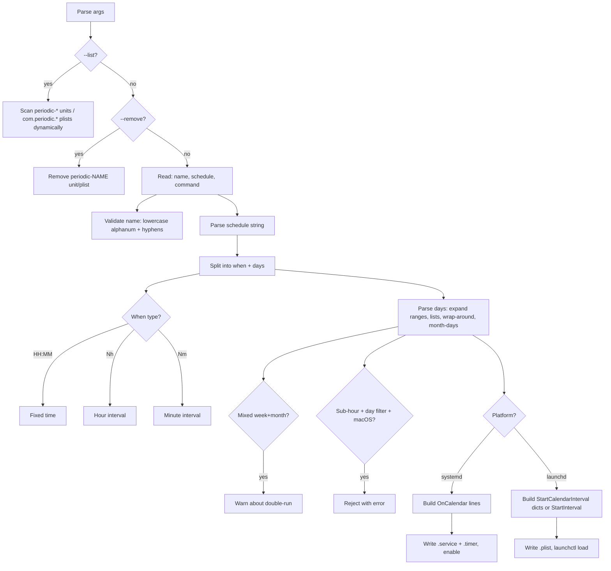

# Plan: Implement schedule syntax for `setup-periodic`

## Context

`setup-periodic` currently accepts only `daily` or `weekly` as hardcoded schedule names, with a `--time` flag for time-of-day. The design doc (`dev-docs/periodic-tasks-design.md`, "Schedule syntax" section) specifies a compact `<when> [<days>]` syntax that replaces this rigid interface with flexible scheduling: specific times, hour/minute intervals, arbitrary day-of-week sets (ranges, lists, wrap-around), and day-of-month.

This is a restructuring of a single file: `private_dot_local/bin/executable_setup-periodic`. The `--list` and `--remove` paths also change (dynamic discovery instead of hardcoded `daily`/`weekly`).

## Current vs New CLI

```
# Old (being removed)
setup-periodic daily  "command" [--time HH:MM] [--email addr]
setup-periodic weekly "command" [--time HH:MM] [--email addr]
setup-periodic --list
setup-periodic --remove daily|weekly

# New
setup-periodic <name> <schedule> "command" [--email addr]
setup-periodic --list
setup-periodic --remove <name>
```

## Changes to `private_dot_local/bin/executable_setup-periodic`



### Step 1: Update CLI definition (lines 10-25)

- Change `args_program_usage` to reflect new `<name> <schedule> "command"` syntax.
- Remove `--time` option entirely.
- Keep `--email`, `--list`, `--remove`, `-v`, `-h`.

### Step 2: Remove `--time` parsing (lines 57-68)

Delete the `--time` block. Time is now embedded in the schedule string.

### Step 3: Add schedule parser (new function, after platform detection)

Add a `parse_schedule()` function that:

1. Splits the schedule string on whitespace into `when_part` and optional `days_part`.
2. Parses `when_part`:
   - `HH:MM` regex `^[0-9]{1,2}:[0-9]{2}$` -> extract hour, minute. Validate 0-23, 0-59.
   - `Nh` regex `^[0-9]+h$` -> extract N. `when_type=interval_h`.
   - `Nm` regex `^[0-9]+m$` -> extract N. `when_type=interval_m`.
   - Anything else -> error.
3. Parses `days_part` (if present):
   - Day name map: `mo=1 tu=2 we=3 th=4 fr=5 sa=6 su=0` (and 3-char aliases `mon tue wed thu fri sat sun`).
   - Split on `,` into tokens.
   - Each token is either:
     - A day range `XX-YY` -> expand. If start > end, wrap around (sa-mo = sa,su,mo).
     - A single day name -> single day number.
     - A bare number 1-31 -> day of month.
   - Collect into two arrays: `weekdays` (0-6) and `monthdays` (1-31).
   - If both non-empty, print a warning about possible double-run.
   - If `days_part` is empty, both arrays are empty (meaning "every day").

4. Platform-specific validation:
   - macOS + sub-hour interval (`Nm` where N < 60) + any day filter -> reject with clear error message.

### Step 4: Add backend mapping functions

**`build_systemd_calendar()`** — produces one or more `OnCalendar=` values:

| Input | Output |
|-------|--------|
| `HH:MM`, no days | `*-*-* HH:MM:00` |
| `HH:MM`, weekdays only | `<systemd-day-spec> *-*-* HH:MM:00` (e.g., `Mon..Sat`) |
| `HH:MM`, monthdays only | `*-*-<days> HH:MM:00` (e.g., `*-*-01,15`) |
| `HH:MM`, mixed | Two `OnCalendar=` lines |
| `Nh`, no days | `*-*-* 0/N:00:00` |
| `Nh`, weekdays | `<days> *-*-* 0/N:00:00` |
| `Nm`, no days | `*-*-* *:0/N:00` |

systemd day-name mapping: consecutive days use `Mon..Fri` range syntax; non-consecutive are listed as `Mon,Wed,Fri`.

**`build_launchd_dicts()`** — produces `<dict>` XML entries:

- Fixed time + weekdays: one dict per weekday with Hour/Minute/Weekday keys.
- Fixed time + monthdays: one dict per monthday with Hour/Minute/Day keys.
- Fixed time, no days: one dict with Hour/Minute only.
- Hour interval + weekdays: enumerate hours (0, N, 2N, ...) x days.
- Hour interval, no days: enumerate hours, one dict per hour.
- Minute interval, no days: use `StartInterval` instead of `StartCalendarInterval`.

### Step 5: Update `--list` (lines 72-103)

Replace hardcoded `periodic-daily`/`periodic-weekly` scan with dynamic discovery:
- **systemd:** `systemctl --user list-timers 'periodic-*.timer' --no-pager`
- **launchd:** `ls /Library/LaunchDaemons/com.periodic.*.plist 2>/dev/null`

### Step 6: Update `--remove` (lines 105-136)

Already takes a name argument. Just remove the implicit `daily|weekly` constraint from the usage text. The current code is generic enough — `periodic-${task_name}` already works with any name.

### Step 7: Update create mode (lines 138-366)

- Change positional parsing: `$1` = name, `$2` = schedule, `$3` = command.
- Validate name: `^[a-z0-9][a-z0-9-]*$` (lowercase, alphanumeric, hyphens, no leading hyphen).
- Call `parse_schedule "$schedule"` to set global vars.
- Replace hardcoded `on_calendar` construction with `build_systemd_calendar`.
- Replace hardcoded weekday dict generation with `build_launchd_dicts`.
- Handle `StartInterval` case for sub-hour intervals on launchd (different plist structure — no `StartCalendarInterval`, use `StartInterval` key instead).
- Use `$name` for unit/plist naming: `periodic-<name>.service`, `com.periodic.<name>.plist`.
- Update summary output to show parsed schedule description.

### Step 8: Update usage text and help

Reflect new examples:
```
setup-periodic <name> <schedule> "command" [--email addr]
setup-periodic --list
setup-periodic --remove <name>
```

## File to modify

`private_dot_local/bin/executable_setup-periodic` — this is the only file that changes. Version bump from 1.0.0 to 2.0.0 (interface change).

## Verification

1. **Syntax parsing** — test various schedule strings manually:
   ```bash
   setup-periodic test-task "4:00 mo-sa" "echo test" --email test@example.com
   setup-periodic test-task2 4h "echo test"
   setup-periodic test-task3 "6:00 1,15" "echo test"
   setup-periodic test-task4 "4:00 sa-mo" "echo test"  # wrap-around
   ```
2. **Error cases**:
   - Invalid name: `setup-periodic "BAD NAME" 4:00 "cmd"` -> error
   - Sub-hour + day on macOS: should reject
   - Missing when: `setup-periodic name "" "cmd"` -> error
   - Invalid day name: `setup-periodic name "4:00 xyz"` -> error
3. **List/remove** — verify dynamic discovery works with custom names.
4. **Backend output review** — inspect generated `.service`/`.timer` files for correct `OnCalendar=` values. On macOS, inspect `.plist` for correct `StartCalendarInterval` dicts.